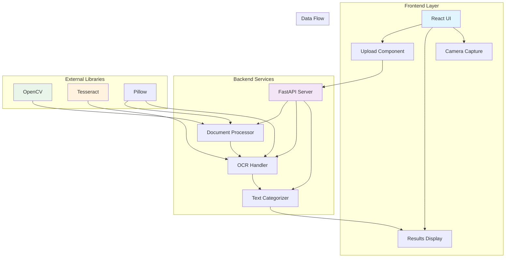
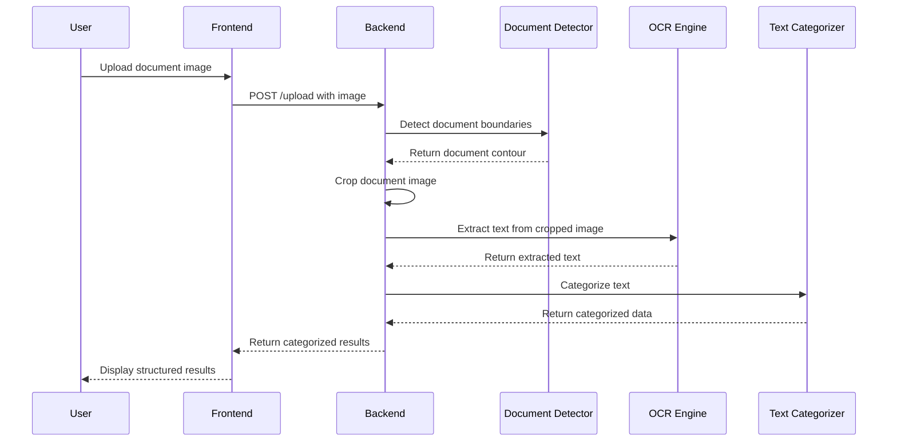
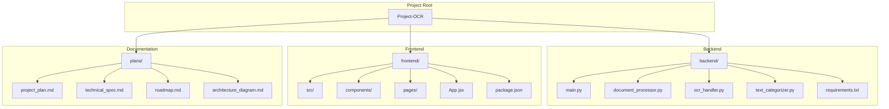

# OCR Document Categorizer - System Architecture

## Component Diagram



## Sequence Diagram



## File Organization



## API Flow

```mermaid
flowchart LR
    A[Image Upload] --> B[Validate File Type]
    B --> C[Save Temp File]
    C --> D[Load Image]
    D --> E[Detect Document Contour]
    E --> F[Crop Document]
    F --> G[Preprocess for OCR]
    G --> H[Extract Text with Tesseract]
    H --> I[Categorize Text]
    I --> J[Format Response]
    J --> K[Return JSON Result]
    K --> L[Clean Up Temp Files]
    
    E -->|No document found| M[Use Full Image]
    M --> G